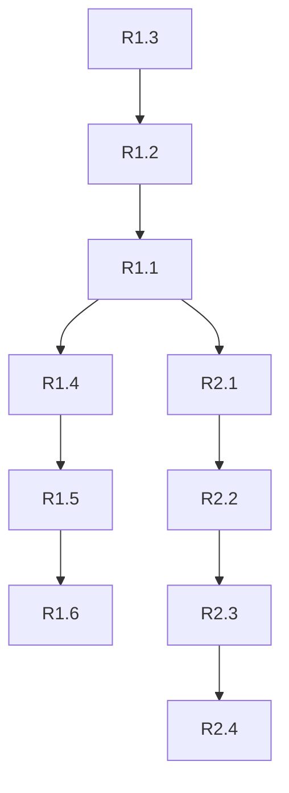

# Requerimientos: Aiyagari HACT 2 Firmas

## V1: Aiyagari 1 Firma con Labor Endógeno

### Funcionales

| ID | Requerimiento | Prioridad | Estado |
|----|---------------|-----------|--------|
| R1.1 | Resolver HJB con oferta laboral endógena | Alta | 🔄 |
| R1.2 | Implementar esquema upwind correcto para $(c,\ell)$ | Alta | 🔄 |
| R1.3 | Pre-calcular $\ell_0(a,z)$ para puntos de ahorro cero | Alta | ✅ |
| R1.4 | Resolver KFE y obtener distribución $g(a,z)$ | Alta | ✅ |
| R1.5 | Calcular curva de oferta de activos $S(r)$ | Alta | ✅ |
| R1.6 | Encontrar equilibrio general (bisección en $r$) | Media | ⏳ |
| R1.7 | Generar gráficos de políticas $(c,\ell,s)$ y distribución | Media | ✅ |

### Técnicos

| ID | Requerimiento | Prioridad | Estado |
|----|---------------|-----------|--------|
| T1.1 | Verificar que filas de matriz $A$ sumen 0 | Alta | ✅ |
| T1.2 | Manejar bordes de grilla (boundary conditions) | Alta | 🔄 |
| T1.3 | Optimizar loops de `fzero` (vectorizar si posible) | Media | ⏳ |
| T1.4 | Documentar código con comentarios en español | Baja | ✅ |

---

## V2: Aiyagari 2 Firmas (Formal/Informal)

### Funcionales

| ID | Requerimiento | Prioridad | Estado |
|----|---------------|-----------|--------|
| R2.1 | Añadir segundo sector con productividad $A_I, \alpha_I$ | Alta | ⏳ |
| R2.2 | Decisión de trabajo intensivo $(\ell_F, \ell_I)$ | Alta | ⏳ |
| R2.3 | FOCs intra-temporales para 2 sectores | Alta | ⏳ |
| R2.4 | Equilibrio en mercado de trabajo $L_F, L_I$ | Alta | ⏳ |
| R2.5 | Flujos de capital hacia cada firma | Media | ⏳ |
| R2.6 | Análisis de distribución por sector | Media | ⏳ |

### Decisiones de Diseño Pendientes

| ID | Pregunta | Opciones | Decisión |
|----|----------|----------|----------|
| D2.1 | ¿Cómo diferenciar sectores? | Salarios, elasticidades, costos fijos | **TBD** |
| D2.2 | ¿Utilidad conjunta o separada? | $(\ell_F+\ell_I)^{1+1/\varphi}$ vs separada | **TBD** |
| D2.3 | ¿Productividad $z$ por sector? | Mismo $z$ vs $(z_F, z_I)$ | **TBD** |
| D2.4 | ¿Mercado de capital? | Único vs segmentado | **TBD** |

---

## Out of Scope (Fuera de Alcance)

- [ ] Transición dinámica (MIT shocks)
- [ ] Más de 2 estados de productividad
- [ ] Riesgo agregado
- [ ] Sector público / impuestos
- [ ] Calibración empírica para país específico

---

## Dependencias entre Requerimientos

